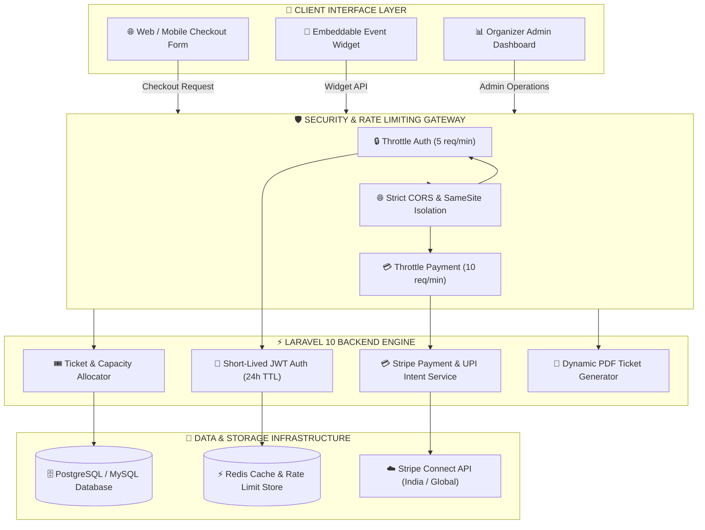
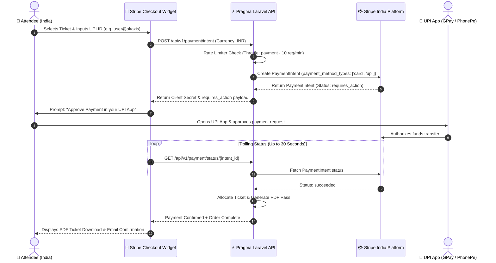
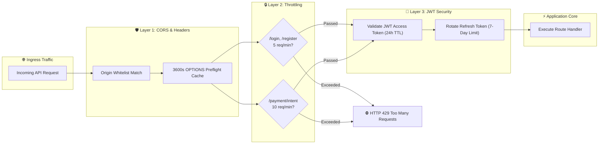

<div align="center">


# ⚡ PRAGMA EMS

### *Hardened Enterprise Event Ticketing & Management Platform*

*Sell tickets for conferences, nightlife events, concerts, workshops, and multi-track festivals with zero per-ticket fees, native Stripe UPI integration, and hardened enterprise security.*

<br>

[](LICENCE)
[](#-security-architecture--hardening)
[](#-india-region--upi-payments-engine)
[](backend)
[](frontend)
[](docker)

<br>

[⚡ Quick Start](#-quick-start) · [🏛️ System Architecture](#-system-architecture) · [🔀 UPI & Payment Flow](#-india-region--upi-payments-engine) · [🛡️ Security Hardening](#-security-architecture--hardening) · [📖 Hosting Guide](HOSTING_GUIDE.md)

</div>

<br>

---

## 🌟 Executive Summary

**Pragma EMS** is an open-source, high-throughput event management and ticketing platform designed to eliminate heavy third-party per-ticket fees while giving organizers total control over branding, payment routing, and customer data.

Re-engineered for production reliability, it incorporates **hardened enterprise rate-limiting**, **short-lived JWT session rotation**, **strict CORS isolation**, and **native Indian UPI payment flows (Google Pay, PhonePe, Paytm, BHIM)** with automated **18% Indian GST** calculation out of the box.

<br>

---

## 🏛️ System Architecture



<br>

---

## 🇮🇳 India Region & UPI Payments Engine

Pragma EMS natively supports Indian payment infrastructure via Stripe Connect. When `APP_CURRENCY=INR`, payment intent creation automatically switches to explicit `['card', 'upi']` payment methods, triggering an interactive authorization flow on the checkout widget.

### 💳 Native UPI Checkout & Async Confirmation Sequence



<br>

---

## 🛡️ Security Architecture & Hardening

Security audit enhancements applied to Pragma EMS:



<br>

---

## 🚀 Key Feature Matrix

<table>
<tr>
<td width="50%" valign="top">

### 🇮🇳 India Regionalization & UPI
- **Stripe UPI Integration**: Support for Google Pay, PhonePe, Paytm, BHIM, and custom VPA IDs.
- **30-Second Async Authorization**: Intelligent frontend polling for user UPI authorization.
- **Indian Financial Standard Defaults**: Pre-configured for `INR (₹)`, `Asia/Kolkata` timezone, and **18% Indian GST**.
- **Dedicated Stripe India Key Isolation**: Separate environment variable bindings for `STRIPE_IN_*`.

</td>
<td width="50%" valign="top">

### 🛡️ Enterprise Security Controls
- **Granular API Rate Limiting**: Dedicated throttles on auth (5 req/min) and payments (10 req/min).
- **Short-Lived JWT Tokens**: Reduced token lifetime to 24h access and 7-day refresh window.
- **HTTPS-Only Secure Cookies**: Enforced `Secure=true` and `SameSite=Lax` cookie flags.
- **Strict Key Generation**: Hardcoded cryptographic fallback keys removed across sample configs.

</td>
</tr>
<tr>
<td width="50%" valign="top">

### 🎟️ Ticketing & Commerce Suite
- **Flexible Ticket Types**: Free, paid, donation, tiered, and hidden presale tickets.
- **Capacity Management**: Real-time inventory tracking and shared ticket capacity pools.
- **Product Add-Ons**: Merch, parking, and VIP pass upsells during checkout.
- **Promo Codes & Access Tokens**: Secret code locks and custom promoter discount links.

</td>
<td width="50%" valign="top">

### 🎨 Customization & Operations
- **Responsive Checkout Widget**: Mobile-first single-page checkout embeddable anywhere.
- **Custom PDF Ticket Generator**: Print-ready PDF tickets with dynamic QR access codes.
- **Real-Time Check-In App**: QR code scanner web app with live check-in audit logs.
- **Zapier & Webhook Engine**: Event-driven webhooks for CRM & marketing automation.

</td>
</tr>
</table>

<br>

---

## ⚡ Platform Comparison

| Feature | Pragma EMS ⚡ | Eventbrite ❌ | TicketTailor ❌ | Dice ❌ |
| :--- | :---: | :---: | :---: | :---: |
| **Self-Hosted & Own Your Data** | ✅ **Yes** | ❌ No | ❌ No | ❌ No |
| **Per-Ticket Platform Fees** | 🆓 **₹0 (Zero Fees)** | 💸 High Fee | 💸 Monthly/Fee | 💸 High Fee |
| **Native Stripe UPI (India)** | ✅ **Yes** | ❌ No | ❌ No | ❌ No |
| **18% Indian GST Engine** | ✅ **Yes** | ❌ No | ❌ Limited | ❌ No |
| **Hardened API Throttling** | ✅ **Yes** | 🔒 Proprietary | 🔒 Proprietary | 🔒 Proprietary |
| **Custom PDF Ticket Builder** | ✅ **Yes** | ❌ No | ✅ Yes | ❌ No |
| **Affiliate & Promoter Links** | ✅ **Yes** | ✅ Yes | ❌ No | ❌ No |
| **Full REST API & Webhooks** | ✅ **Yes** | ✅ Yes | ✅ Yes | ❌ Limited |

<br>

---

## 🛠️ Quick Start

### Docker Compose (Recommended)

```bash
# 1. Clone repository
git clone https://github.com/rehaan-ahmad/pragma.git
cd pragma/docker/all-in-one

# 2. Generate cryptographically secure keys
echo "APP_KEY=base64:$(openssl rand -base64 32)" >> .env
echo "JWT_SECRET=$(openssl rand -base64 32)" >> .env

# 3. Spin up environment
docker compose up -d
```

Open `http://localhost:8123` in your browser.

<br>

### Manual Local Development Setup

#### Backend (Laravel 10)
```bash
cd backend
composer install
cp .env.example .env
php artisan key:generate
php artisan jwt:secret
php artisan migrate --seed
php artisan serve
```

#### Frontend (React 18)
```bash
cd frontend
npm install
npm run dev
```

<br>

---

## 📚 Complete Documentation

- 📖 **[Comprehensive Hosting Guide](HOSTING_GUIDE.md)** — Production deployment & infrastructure hardening checklist.
- 📋 **[Handover Document](HANDOVER.md)** — Complete audit log of security & UPI changes.
- 🔒 **[Security Policy](SECURITY.md)** — Vulnerability response and security design guidelines.
- 🤝 **[Contributing Guide](CONTRIBUTING.md)** — Developer setup and PR workflow.

<br>

---

## 📜 License

Pragma EMS is licensed under the **AGPL-3.0 License**.

<br>

<div align="center">

**Pragma EMS** · *Empowering Event Organizers Worldwide*

Made with ❤️ & ⚡

</div>
